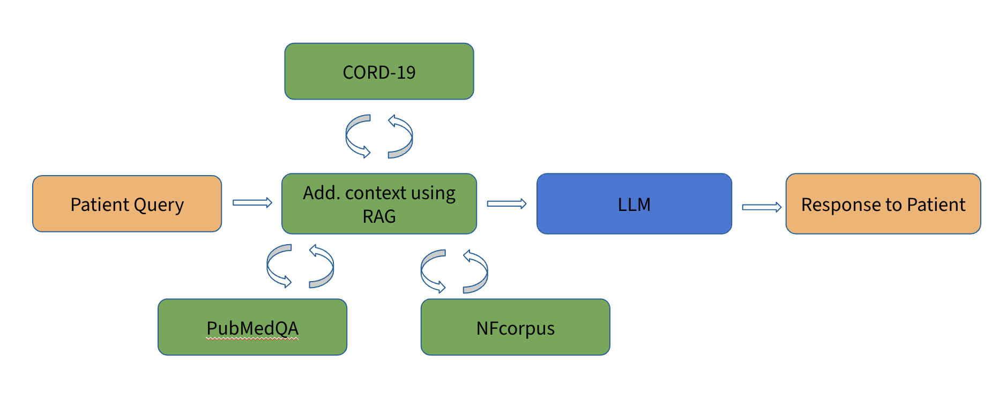

# MedBud

Cross-Platform seamless chat application that performs CDQA + RAG + CoT tailored towards Medical Q&amp;A, Carried out as part of MED 277, UCSD Fall '24

# Overview

**MedBud:** The Medical Q&A App, is a state-of-the-art solution designed as a Proof of Concept (POC) for providing accurate, context-aware answers to medical-related inquiries. Leveraging the power of OpenAI's GPT and self-hosted Retrieval-Augmented Generation (RAG), it integrates sophisticated language models with a specialized medical knowledge base. This application is not only a baseline for building scalable applications in the healthcare domain but also features a user-friendly interface with speech-to-text capabilities and document upload options. Intended for continuous updates, our goal is to enhance its generalization, scalability, and modularity, making it an easily accessible and reliable resource for patients, healthcare professionals, and anyone seeking medical information.

An overview of implementation is given below. 

## Requirements:

1. Running the app on your machine (No dev): Have Docker installed on your Mac/PC: The application is now containerized
   in a docker environment and the deployment file is added in the source directory under `docker-compose.yml`.

2. Developing/testing purposes: If you want to have a development environment you'll need to
   install ``npm``, ``node``, ``Python 3.6+`` and follow the README's of the respective
   directories. ``src/main/marshaler`` has the backend code. ``src/main/ui/web/medi-mate`` has the frontend.

3. Mandatory Requirement: You'll need an `OPENAI_API_KEY` and add that to a .env file.
   An `env.example` is given in the root directory of the repo. To get the API token follow instructions in [OpenAI API](https://openai.com/blog/openai-api)

## Running the application:

To run the application (Production build deployment for demo purpose only, not a dev environment):

1. Navigate to the project root directory in your terminal.
2. Run ``docker-compose up``.
3. Wait a while for frontend and backend containers to spawn.
4. Go to http://localhost:3000/ to start chatting

